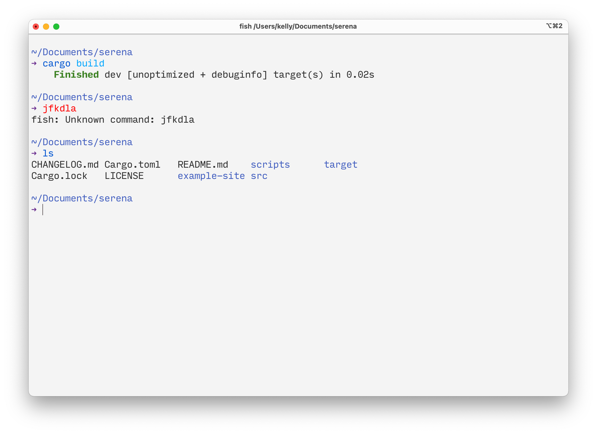

# 💧 Raindrop

A calm light color scheme for the tools I use, based on VS Code's "Quiet Light" and [Witch Hazel](http://witchhazel.thea.codes).

Icons from [FileIcons](https://github.com/braver/FileIcons).

## Screenshots

Sublime Text 4

iTerm 2

